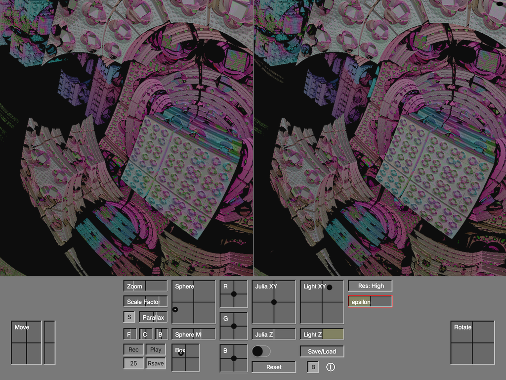

# MandelBox
MandelBox rendered with Ray Marching on IOS using Swift and Metal for the iPad

Be sure to visit:  http://digitalfreepen.com/mandelbox370/
where I stole all the ideas.

Great app for draining your iPad battery.
Need to optimize navigation to make it easier to get from one fantastic image to the next..

I have the image size trimmed way low so that rendering is fast and smooth (viewController.swift, line #4).
Bump the size much higher for beautiful images (although slow).

